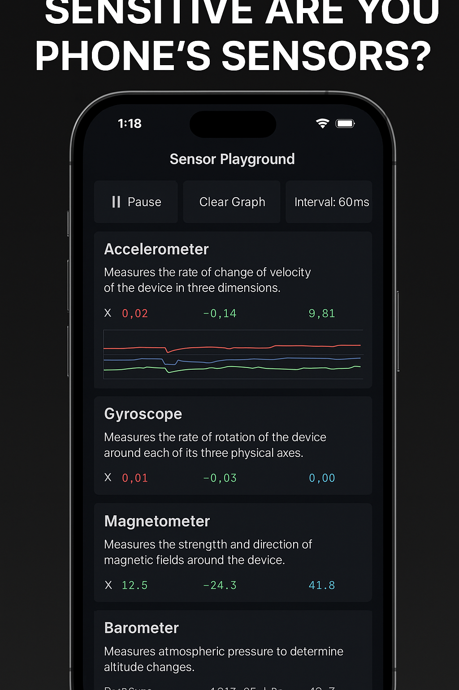

# Sensor Playground

**Sensor Playground** is a feature-based React Native app built with Expo that visualizes real-time data from various mobile sensors.

> 🔧 Ideal for learning, debugging, and exploring mobile hardware behavior in a structured, modern app.

🎥 TikTok Demo
Watch Sensor Playground in action on TikTok:

👉https://www.tiktok.com/@isaias.chavez82/video/7493263176251837701

A real-time mobile sensor dashboard built with React Native and Expo. See live motion, orientation, and environmental data visualized on screen.

---

## 📲 Features

- 📡 Real-time readings from:
  - Accelerometer (with live chart)
  - Gyroscope
  - Magnetometer
  - Barometer
  - Orientation (pitch, roll, yaw)
  - Proximity (simulated)
  - Ambient Light (simulated on iOS, real on Android)
- 🌙 Dark mode interface
- 🎛 Global control panel:
  - Pause/resume sensors
  - Adjust sampling interval
  - Clear chart data
- 📦 Modular **feature-based architecture**
- 🧪 Built with **Expo SDK + EAS Update**
- 🧾 Fully scrollable dashboard UI

---

## 📦 Technologies Used

- [Expo SDK](https://docs.expo.dev/)
- [React Native](https://reactnative.dev/)
- [expo-sensors](https://docs.expo.dev/versions/latest/sdk/sensors/)
- [react-native-svg](https://github.com/software-mansion/react-native-svg)

